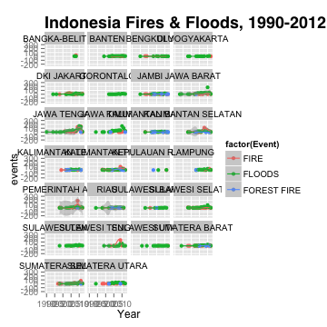
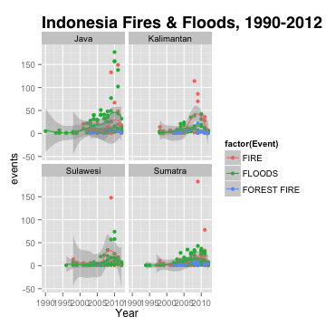
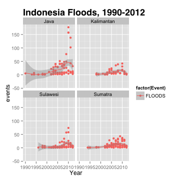
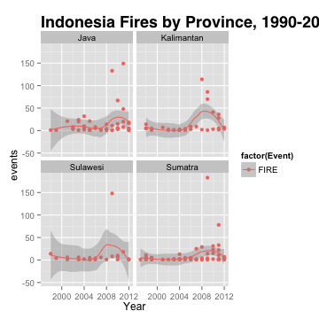
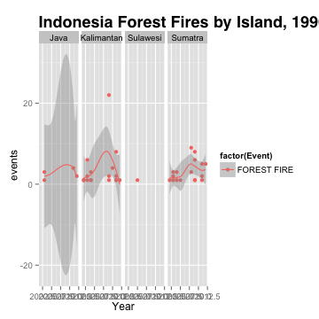
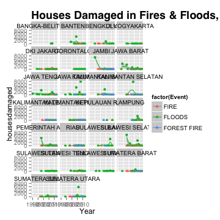
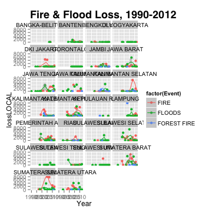
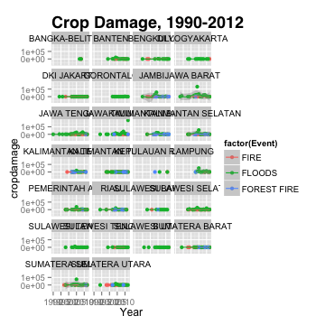
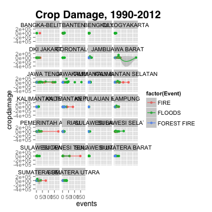
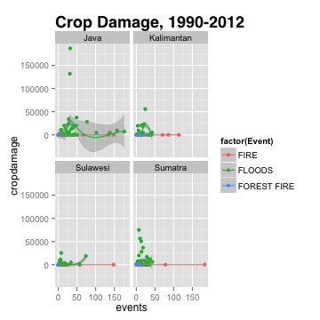

Indonesia Fires & Floods
========================================================
author: Danielle Robinson & Julia Bowling
date: December 21, 2015

Agenda
========================================================
- Background
- Disasters
- Timeline
- Geography and Environment
- Sources & Variables
- Analysis
- Discussion
- Policy Recommendation

Disasters in Indonesia
========================================================
- Floods, Earthquake, Landslides, Volcano, Epidemic, Forest Fires, Storms, Drought, Tsunami, Strong Wind, Floods and Landslides, Surge, Transportation Accident, Forest Fire, Eruption, Conflict, Earthquake and Tsunami, Terrorism, Industrial Accident, Plague, Climate Change, Hunger

Natural Disasters: Loss & Distribution
========================================================

***


Disasters in Indonesia: Our Focus
========================================================
- Fires
- Floods
- Forest Fires

Disasters in Indonesia
========================================================
- Timeline
- Major Events
- Why Indonesia?
- Factor: Geography

Floods & Fires: A National Timeline
========================================================
- 1988 - NASA climate scientist James Hansel declared global warming as a cause of increased heatwaves and drought
- 1995 - Larson A arctic ice shelf collapse in 1995 (Source: Greenpeace)
- 2004 - Tsunami (Aceh)
- 2006 - Sidoarjo mudslide, 40,000 evacuated (East Java)
- 2010 - Wasior floods, 145 dead, 7,900 evacuated (West Papau)
- 2013 - Greenhouse gases measured above 400 ppm (Manau Loa)
- 2014 - Karangkobar landslide, approx 100 deaths (Central Java)
- 2014 - Flood, 80,000 displaced (North Sulawesi)
- 2015 - Great Garuda construction begins (Jakarta)

Background of Indonesia
========================================================

***
- Population over 255 million
- Over 17,000 islands
- 700 regional languages
- Industry and Agriculture
- Cost of air pollution from CO2 emissions: $400 million

Indonesian Geography
========================================================
- Provinces & Islands


Java
========================================================

***
- 58% of Indonesian population
- Jakarta: Sinking City
- Great Garuda: Seawall

Sumatra
========================================================
- Aceh 2004 Tsunami


Kalimantan (Borneo)
========================================================

***
- Forest Fires
- Peatlands
- Government Incentive
- Community Adaptation Plans


Sulawesi
========================================================

***
- 2014 flood in north Sulawesi
- 80,000 evacuees 
- $580 million in damages

Environmental Factors
========================================================

***
- Peatlands
- Primary Forest
- Aforestation and destruction of habitat
- Endemic Species, 36%

Environmental Challenges
========================================================
- Flooding
- Depleted Aquifers
- Sea Level Rise
- Forest Fires
- Intentional Burning

Flooding
========================================================

***
- Highest incidence of natural disasters each year
- Lack solid waste management system
- Low capacity for water purification
- High levels of E. Coli

Depleted Aquifers
========================================================
- Illegal groundwater extraction
- Shallow wells
- Subsidence
- 40% of Jakarta below sea level

Sea Level Rise (SLR)
========================================================
- Rise in global temperatures
- Global Annual Average SLR: 0.33 inches
- Jakarta: 3 inches

Forest Fires
========================================================
- Palm Oil and Pulp-Paper concessions
- Strong Winds; Drought; Drained Peatlands; CO2 Emissions


Multi-Lateral Frameworks
========================================================
- Hyogo Framework for Action 2005 - 2015
- Sendai Framework for Disaster Risk Reduction 2015 - 2030 
- Bali Action Plan 2007

Data
========================================================
- World Bank
- DesInventar (UN International Strategy for Disaster Risk Reduction)
- 4 Islands: Sulawesi, Sumatra, Java, Kalimantan
- 26 Provinces
- 4488 events
- Dates 1990 - 2012

Questions
========================================================
- What type of natural disaster, fires or floods, contributes more to loss of livelihood and economic loss?
- Does conservation of forests help to decrease economic loss?
- Does the increased occurance of natural disasters increase economic loss?

Hypotheses
========================================================
- H0: There is no difference in economic loss from natural disasters including fires, forest fires, and floods.
- HA: There is an increase in economic loss from natural disasters including fires, forest fires, and floods.

Assumptions
========================================================
- 1. Increase in injured people after floods
- 2. Higher fire risk between May and September
- 3. Increase in local government intervention, decrease in fire loss
- 4. Inverse relationship between mobile technology use and number of people injured or deaths
- 5. Dredged areas experience less loss
- 6. Floods increase with high levels of groundwater extraction
- 7. Forest Fire risk increases in older concessions

Data Work
========================================================


```r
library("ggplot2")
library("ggplot2")
library("tidyr")
library("dplyr")
require(scales)
opts_chunk$set(fig.width=5, fig.height=5)
indo <- read.csv("newindo.csv")
code <- read.csv("islands.csv")
indo <- left_join(indo, code, by=NULL, copy=FALSE)
```

Data Work, continued.
========================================================


```r
indo.agg <- indo %>%
  group_by(Event, Province, Year, Island) %>%
  summarise(events=sum(DataCards, na.rm=TRUE), deaths=sum(Deaths, na.rm=TRUE), injured=sum(Injured, na.rm=TRUE), missing=sum(Missing, na.rm=TRUE), housesdestroyed=sum(Houses.Destroyed, na.rm=TRUE), housesdamaged=sum(Houses.Damaged, na.rm=TRUE), victims=sum(Victims, na.rm=TRUE), affected=sum(Affected, na.rm=TRUE), evacuated=sum(Evacuated, na.rm=TRUE), lossUSD=sum(Losses..USD, na.rm=TRUE), lossLOCAL=sum(Losses..Local, na.rm=TRUE), cropdamage=sum(Damages.in.crops.Ha., na.rm=TRUE), agriculture=sum(Agriculture, na.rm=TRUE), power=sum(Power.and.Energy, na.rm=TRUE), relief=sum(Relief, na.rm=TRUE), forest=sum(Plantation.Forest, na.rm=TRUE))
```

Final Dataset
========================================================

```r
summary(indo.agg)
```

```
         Event                   Province        Year     
 FIRE       :162   KALIMANTAN TIMUR  : 31   Min.   :1990  
 FLOODS     :290   JAWA TENGAH       : 28   1st Qu.:2003  
 FOREST FIRE: 41   SULAWESI SELATAN  : 27   Median :2006  
                   JAWA BARAT        : 26   Mean   :2006  
                   SUMATERA BARAT    : 26   3rd Qu.:2010  
                   KALIMANTAN SELATAN: 25   Max.   :2012  
                   (Other)           :330                 
        Island        events           deaths           injured       
 Java      :129   Min.   :  1.00   Min.   :  0.000   Min.   :    0.0  
 Kalimantan: 98   1st Qu.:  2.00   1st Qu.:  0.000   1st Qu.:    0.0  
 Sulawesi  : 90   Median :  5.00   Median :  0.000   Median :    0.0  
 Sumatra   :176   Mean   : 12.35   Mean   :  5.032   Mean   :  412.6  
                  3rd Qu.: 12.00   3rd Qu.:  4.000   3rd Qu.:    3.0  
                  Max.   :183.00   Max.   :347.000   Max.   :60149.0  
                                                                      
    missing        housesdestroyed   housesdamaged        victims 
 Min.   :  0.000   Min.   :    0.0   Min.   :    0.0   Min.   :0  
 1st Qu.:  0.000   1st Qu.:    0.0   1st Qu.:    0.0   1st Qu.:0  
 Median :  0.000   Median :    0.0   Median :    0.0   Median :0  
 Mean   :  1.213   Mean   :  279.2   Mean   :  341.7   Mean   :0  
 3rd Qu.:  0.000   3rd Qu.:   77.0   3rd Qu.:    0.0   3rd Qu.:0  
 Max.   :140.000   Max.   :21924.0   Max.   :26623.0   Max.   :0  
                                                                  
    affected         evacuated         lossUSD    lossLOCAL        
 Min.   :      0   Min.   :     0   Min.   :0   Min.   :        0  
 1st Qu.:      0   1st Qu.:     0   1st Qu.:0   1st Qu.:        0  
 Median :      0   Median :     0   Median :0   Median :        0  
 Mean   :  24216   Mean   :  7770   Mean   :0   Mean   :   345969  
 3rd Qu.:    564   3rd Qu.:  1000   3rd Qu.:0   3rd Qu.:     1400  
 Max.   :4515837   Max.   :522569   Max.   :0   Max.   :133500220  
                                                                   
   cropdamage      agriculture         power       relief 
 Min.   :     0   Min.   : 0.000   Min.   :0   Min.   :0  
 1st Qu.:     0   1st Qu.: 0.000   1st Qu.:0   1st Qu.:0  
 Median :     0   Median : 0.000   Median :0   Median :0  
 Mean   :  2769   Mean   : 3.156   Mean   :0   Mean   :0  
 3rd Qu.:   284   3rd Qu.: 2.000   3rd Qu.:0   3rd Qu.:0  
 Max.   :186530   Max.   :90.000   Max.   :0   Max.   :0  
                                                          
     forest        
 Min.   :     0.0  
 1st Qu.:     0.0  
 Median :     0.0  
 Mean   :   667.7  
 3rd Qu.:     0.0  
 Max.   :186022.0  
                   
```

Subsets by Disaster Type
========================================================

```r
indo.agg$death <- as.numeric(indo.agg$deaths>0)
floods<-subset(indo.agg, Event == "FLOODS", drop=FALSE)
fires<-subset(indo.agg, Event=="FIRE", drop=FALSE)
forestfires<-subset(indo.agg, Event=="FOREST FIRE", drop=FALSE)
```
Aggregating by Island
========================================================

```r
indoisland.agg <- indo %>%
  group_by(Event, Island, Year) %>%
  summarise(events=sum(DataCards, na.rm=TRUE), deaths=sum(Deaths, na.rm=TRUE), injured=sum(Injured, na.rm=TRUE), missing=sum(Missing, na.rm=TRUE), housesdestroyed=sum(Houses.Destroyed, na.rm=TRUE), housesdamaged=sum(Houses.Damaged, na.rm=TRUE), victims=sum(Victims, na.rm=TRUE), affected=sum(Affected, na.rm=TRUE), evacuated=sum(Evacuated, na.rm=TRUE), lossUSD=sum(Losses..USD, na.rm=TRUE), lossLOCAL=sum(Losses..Local, na.rm=TRUE), cropdamage=sum(Damages.in.crops.Ha., na.rm=TRUE), agriculture=sum(Agriculture, na.rm=TRUE), power=sum(Power.and.Energy, na.rm=TRUE), relief=sum(Relief, na.rm=TRUE), forest=sum(Plantation.Forest, na.rm=TRUE))
```

Data by Island
========================================================


```r
head(indoisland.agg)
```

```
Source: local data frame [6 x 19]
Groups: Event, Island [1]

   Event Island  Year events deaths injured missing housesdestroyed
  (fctr) (fctr) (int)  (int)  (int)   (int)   (int)           (int)
1   FIRE   Java  1998      1      0       0       0             362
2   FIRE   Java  1999      1      0       0       0              38
3   FIRE   Java  2001     21      0       3       0              18
4   FIRE   Java  2002     16      0       0       0            1996
5   FIRE   Java  2003     45     23     791       0            3370
6   FIRE   Java  2004     56     18       1       0            1971
Variables not shown: housesdamaged (int), victims (int), affected (int),
  evacuated (int), lossUSD (int), lossLOCAL (dbl), cropdamage (dbl),
  agriculture (int), power (int), relief (int), forest (int)
```

```r
summary(indoisland.agg)
```

```
         Event           Island        Year          events      
 FIRE       :56   Java      :35   Min.   :1990   Min.   :  1.00  
 FLOODS     :62   Kalimantan:35   1st Qu.:2002   1st Qu.:  5.00  
 FOREST FIRE:19   Sulawesi  :29   Median :2005   Median : 15.00  
                  Sumatra   :38   Mean   :2005   Mean   : 44.46  
                                  3rd Qu.:2009   3rd Qu.: 56.00  
                                  Max.   :2012   Max.   :525.00  
     deaths          injured         missing        housesdestroyed
 Min.   :  0.00   Min.   :    0   Min.   :  0.000   Min.   :    0  
 1st Qu.:  0.00   1st Qu.:    0   1st Qu.:  0.000   1st Qu.:    0  
 Median :  4.00   Median :    0   Median :  0.000   Median :   52  
 Mean   : 18.11   Mean   : 1485   Mean   :  4.365   Mean   : 1005  
 3rd Qu.: 18.00   3rd Qu.:   27   3rd Qu.:  0.000   3rd Qu.:  578  
 Max.   :347.00   Max.   :60423   Max.   :150.000   Max.   :27570  
 housesdamaged      victims     affected         evacuated      
 Min.   :    0   Min.   :0   Min.   :      0   Min.   :      0  
 1st Qu.:    0   1st Qu.:0   1st Qu.:      0   1st Qu.:      0  
 Median :    0   Median :0   Median :    367   Median :    400  
 Mean   : 1230   Mean   :0   Mean   :  87142   Mean   :  27962  
 3rd Qu.:   51   3rd Qu.:0   3rd Qu.:   5879   3rd Qu.:   5389  
 Max.   :36764   Max.   :0   Max.   :4558659   Max.   :1084376  
    lossUSD    lossLOCAL           cropdamage      agriculture    
 Min.   :0   Min.   :        0   Min.   :     0   Min.   :  0.00  
 1st Qu.:0   1st Qu.:       23   1st Qu.:     0   1st Qu.:  0.00  
 Median :0   Median :     2291   Median :     0   Median :  0.00  
 Mean   :0   Mean   :  1244983   Mean   :  9964   Mean   : 11.36  
 3rd Qu.:0   3rd Qu.:    21853   3rd Qu.:  1787   3rd Qu.:  4.00  
 Max.   :0   Max.   :133501384   Max.   :186718   Max.   :239.00  
     power       relief      forest      
 Min.   :0   Min.   :0   Min.   :     0  
 1st Qu.:0   1st Qu.:0   1st Qu.:     0  
 Median :0   Median :0   Median :     0  
 Mean   :0   Mean   :0   Mean   :  2403  
 3rd Qu.:0   3rd Qu.:0   3rd Qu.:    50  
 Max.   :0   Max.   :0   Max.   :188216  
```

Data by Province
========================================================


```r
head(indo.agg)
```

```
Source: local data frame [6 x 21]
Groups: Event, Province, Year [6]

   Event        Province  Year  Island events deaths injured missing
  (fctr)          (fctr) (int)  (fctr)  (int)  (int)   (int)   (int)
1   FIRE BANGKA-BELITUNG  2008 Sumatra     29      0       0       0
2   FIRE          BANTEN  2003    Java      1      0       0       0
3   FIRE          BANTEN  2004    Java      2      0       0       0
4   FIRE          BANTEN  2005    Java      1      0       0       0
5   FIRE          BANTEN  2009    Java      1      0       0       0
6   FIRE          BANTEN  2010    Java      4      2       0       0
Variables not shown: housesdestroyed (int), housesdamaged (int), victims
  (int), affected (int), evacuated (int), lossUSD (int), lossLOCAL (dbl),
  cropdamage (dbl), agriculture (int), power (int), relief (int), forest
  (int), death (dbl)
```

```r
summary(indo.agg)
```

```
         Event                   Province        Year     
 FIRE       :162   KALIMANTAN TIMUR  : 31   Min.   :1990  
 FLOODS     :290   JAWA TENGAH       : 28   1st Qu.:2003  
 FOREST FIRE: 41   SULAWESI SELATAN  : 27   Median :2006  
                   JAWA BARAT        : 26   Mean   :2006  
                   SUMATERA BARAT    : 26   3rd Qu.:2010  
                   KALIMANTAN SELATAN: 25   Max.   :2012  
                   (Other)           :330                 
        Island        events           deaths           injured       
 Java      :129   Min.   :  1.00   Min.   :  0.000   Min.   :    0.0  
 Kalimantan: 98   1st Qu.:  2.00   1st Qu.:  0.000   1st Qu.:    0.0  
 Sulawesi  : 90   Median :  5.00   Median :  0.000   Median :    0.0  
 Sumatra   :176   Mean   : 12.35   Mean   :  5.032   Mean   :  412.6  
                  3rd Qu.: 12.00   3rd Qu.:  4.000   3rd Qu.:    3.0  
                  Max.   :183.00   Max.   :347.000   Max.   :60149.0  
                                                                      
    missing        housesdestroyed   housesdamaged        victims 
 Min.   :  0.000   Min.   :    0.0   Min.   :    0.0   Min.   :0  
 1st Qu.:  0.000   1st Qu.:    0.0   1st Qu.:    0.0   1st Qu.:0  
 Median :  0.000   Median :    0.0   Median :    0.0   Median :0  
 Mean   :  1.213   Mean   :  279.2   Mean   :  341.7   Mean   :0  
 3rd Qu.:  0.000   3rd Qu.:   77.0   3rd Qu.:    0.0   3rd Qu.:0  
 Max.   :140.000   Max.   :21924.0   Max.   :26623.0   Max.   :0  
                                                                  
    affected         evacuated         lossUSD    lossLOCAL        
 Min.   :      0   Min.   :     0   Min.   :0   Min.   :        0  
 1st Qu.:      0   1st Qu.:     0   1st Qu.:0   1st Qu.:        0  
 Median :      0   Median :     0   Median :0   Median :        0  
 Mean   :  24216   Mean   :  7770   Mean   :0   Mean   :   345969  
 3rd Qu.:    564   3rd Qu.:  1000   3rd Qu.:0   3rd Qu.:     1400  
 Max.   :4515837   Max.   :522569   Max.   :0   Max.   :133500220  
                                                                   
   cropdamage      agriculture         power       relief 
 Min.   :     0   Min.   : 0.000   Min.   :0   Min.   :0  
 1st Qu.:     0   1st Qu.: 0.000   1st Qu.:0   1st Qu.:0  
 Median :     0   Median : 0.000   Median :0   Median :0  
 Mean   :  2769   Mean   : 3.156   Mean   :0   Mean   :0  
 3rd Qu.:   284   3rd Qu.: 2.000   3rd Qu.:0   3rd Qu.:0  
 Max.   :186530   Max.   :90.000   Max.   :0   Max.   :0  
                                                          
     forest             death       
 Min.   :     0.0   Min.   :0.0000  
 1st Qu.:     0.0   1st Qu.:0.0000  
 Median :     0.0   Median :0.0000  
 Mean   :   667.7   Mean   :0.4665  
 3rd Qu.:     0.0   3rd Qu.:1.0000  
 Max.   :186022.0   Max.   :1.0000  
                                    
```

Indonesian Fires & Floods
========================================================
 
***
- Increase in events over time

Indonesian Fires & Floods by Island
========================================================
 
***
- Increase in events over time

Floods by Island
========================================================
- 162 floods on average per province
- Highest increase on Java

 

Fires by Island
========================================================
- Increase in events over time
- Increase in fires in Kalimantan

 

Forest Fires by Island
========================================================
- Increase in events over time
- Increase in fires in Kalimantan

 

Houses Damaged in Fires and Floods
========================================================
- Increase in events over time

 

Distribution of Local Loss by Number of Events
========================================================
 
***
- Certain provinces incur more loss from events overall
- Cumulative number of low loss events
- Impact of few events with high economic loss

Crop Damages by Province over Time
========================================================
 
***
- Certain provinces with more damage; Increase in floods since 2000

Crop Damages by Province, Events
========================================================
 
***
- Forest fires incure high costs from damage
- Gorontalo, Sulawesi - increase in floods and fires and number of hectares damaged
- Aceh and Riau, Sumatra - damage from fires in north, damage from floods in south

Crop Damages by Island, Events
========================================================
 

Data Analysis
========================================================
- Models

```
lmer(formula = lossLOCAL ~ events + housesdamaged + (1 | death), 
    data = floods)
              coef.est  coef.se  
(Intercept)    70506.47 123704.71
events          4238.39   4699.44
housesdamaged    -10.64     41.17

Error terms:
 Groups   Name        Std.Dev.  
 death    (Intercept)       0.20
 Residual             1766464.21
---
number of obs: 290, groups: death, 2
AIC = 9120, DIC = 9215.9
deviance = 9163.0 
```
***
$y_{i}=\beta_0+\beta_{1}x_{i}+\beta_{2}x_{i}+\beta_{3}x_{i}+\epsilon_{i}$
- $y_{i}$ = local economic loss in Rupiah
- $\beta_{1}$ = events
- $\beta_{2}$ = houses damaged
- $\beta_{3}$ = any death (binary)

Data Analysis
========================================================
- Models

```
glm(formula = lossLOCAL ~ events + housesdestroyed + deaths, 
    data = floods)
                coef.est  coef.se  
(Intercept)      75768.72 126330.57
events            4327.04   4727.37
housesdestroyed     -9.43     57.71
deaths           -1195.36   4187.71
---
  n = 290, k = 4
  residual deviance = 8.954042e+14, null deviance = 8.982703e+14 (difference = 2.866181e+12)
  overdispersion parameter = 3.130784e+12
  residual sd is sqrt(overdispersion) = 1769402.09
```
***
$y_{i}=\beta_0+\beta_{1}x_{i}+\beta_{2}x_{i}+\beta_{3}x_{i}+\epsilon_{i}$
- $y_{i}$ = local economic loss in Rupiah
- $\beta_{1}$ = events
- $\beta_{2}$ = houses destroyed
- $\beta_{3}$ = deaths

Discussion
========================================================
- Focus on prevention and anticipatory plans
- Urban evacuation routes
- Reduce intentional fires

Adaptation Efforts
========================================================
- Sea Wall
- Early Warning System
- Dredging
- GM crops

Great Garuda Sea Wall
========================================================

***
- Prevents storm surges from reaching land
- Erodes islands, reefs
- Marine ecosystem damage
- Doesn't address groundwater extraction problem

Early Warning System
========================================================

***
- Multi-hazard system
- Model for recovery strategies, not prevention strategies
- Columbia Institute, 2008
- NINO4 Index

Dredging
========================================================
- Port of Jakarta
- Training Dikes lower local sea level depth
- Sohei Matsuno, Professor
- Increase of 1.5 meters in 2020 above 2013 level

Genetic Modification
========================================================
- Increase of GMO crops: palm oil and bananas
- High toleration of saline and high water levels

Policy Recommendation
========================================================
- Implentation of adaptation efforts
- Implementation of multi-hazard early warning systems
- Mitigate effects of Great Garuda with water purification & wastewater treatment
- Create local community adaptation task forces in provinces

THE END
========================================================

***
Thank you

